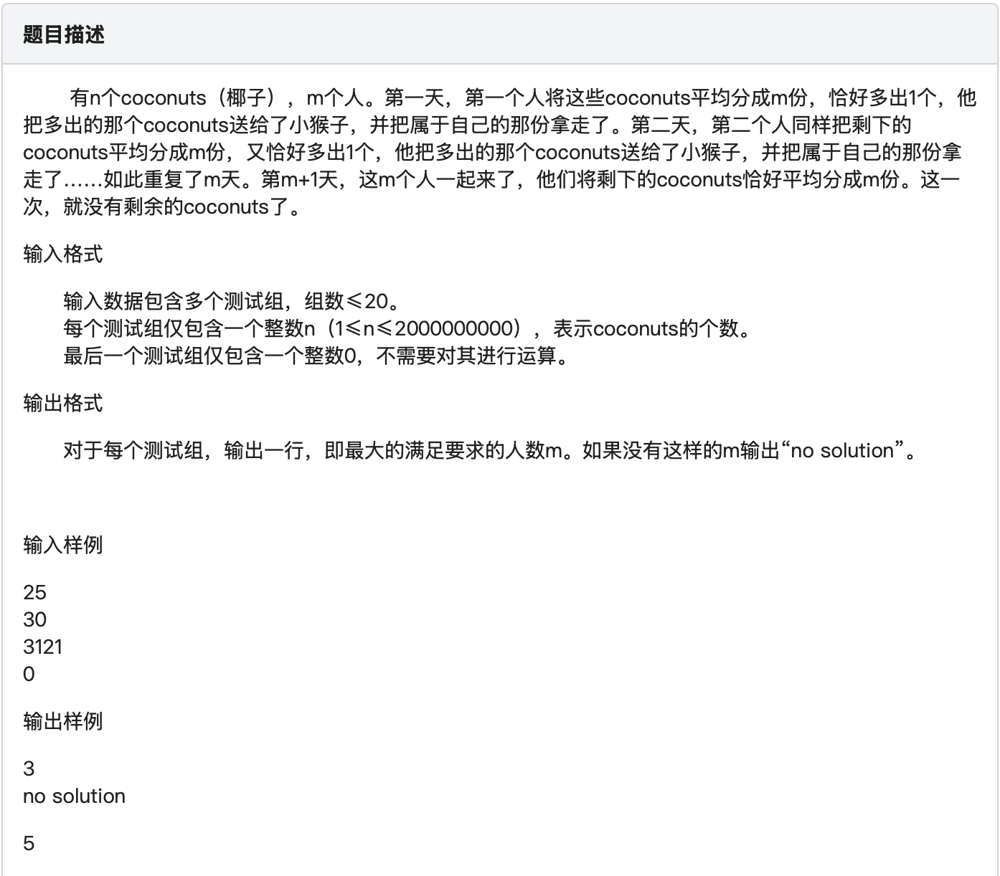

## 111. Coconuts

http://yoj.ruc.edu.cn/index.php/index/problem/detail/pno/111.html



```c
#include <stdio.h>
#include <math.h>

int check(int n, int m) {
    // 检查是否满足条件（有很多种方法）
    int cnt = 0;
    while (true) {
        cnt++;
        if ((cnt == m + 1) && (n % m == 0)) {
            // “第 m + 1 天，将剩下的 coconuts 恰好平均分成 m 份，且没有剩余的 coconuts 了”
            return 1;
        }
        if (n < m || n % m != 1 || cnt > m + 1) {
            return 0;
        }
        n = n - ( n / m ) - 1;
    }
}

int main() {
    int n, cn;
    while (1) {
        scanf("%d", &n);
        if (n == 0) break;
        cn = 1;
        for (int m = cbrt(n); m >= 1; m--) { // 经验上界
            // 遍历所有可能的m值，找到一个合适的m值就输出并跳出循环
            if (check(n, m)) {
                printf("%d\n", m);
                cn = 0;
                break;
            }
        }
        if (cn) {
            printf("no solution\n");
        }
    }
    return 0;
}
```

<span style="color: red">注意：</span> 关于 $m < \sqrt{n}$，是一个来自“经验”的直观——并不是所有 $1$ 到 $n$ 中的数都是 $m$ 的可能值

具体来说，
第$1$天操作后，剩下的椰子数$n_1$有
$$
n_1 = n - 1 - \frac{n - 1}{m} = \left(n - 1\right)\cdot \left(1 - \frac{1}{m}\right)
$$
这里要求 $m$ 能整除 $n - 1$
第$2$天操作后，剩下的椰子数$n_2$有
$$
n_2 = \left(n - 1\right)\cdot \left(1 - \frac{1}{m}\right)^2 - \left(1 - \frac{1}{m}\right)
$$
以此类推，第 $m$ 天操作后，剩下的椰子数$n_m$有
$$
n_m = \left(n - 1\right)\cdot \left(1 - \frac{1}{m}\right)^m - \prod_{i=1}^{m} \left(\frac{1}{i}-1\right) \geq m
$$
对于经验上界 $\sqrt{n}$，上式成立
