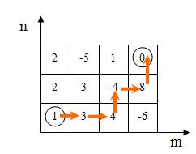

## 126. travel

有一个n*m的棋盘，如图所示，骑士X最开始站在方格`(1,1)`中，目的地是方格`(n,m)`。他的每次都只能移动到上、左、右相邻的任意一个方格。每个方格中都有一定数量的宝物k（可能为负），对于任意方格，骑士X能且只能经过最多1次（因此从`(1,1)`点出发后就不能再回到该点了）。 



你的任务是，帮助骑士X从`(1,1)`点移动到`(n,m)`点，且使得他获得的宝物数最多。

### 输入格式

- 输入共有`n+1`行。
- 第一行为两个整数`n`和`m`（1 <= n, m <= 8 ）。
- 接下来`n`行，每行有`m`个整数，每`2`个整数之间由一个空格分隔。第`i+1`行第`j`个整数表示方格`( i，j )`中的宝物数目`k`（-100 <= k <= 100）。

### 输出格式

输出数据仅一个整数，即为骑士获得的宝物数。

### 输入样例

```
3 4
1 3 4 -6
2 3 -4 8
2 -5 1 0
```

#### 输出样例

```
12
```

#### 示例（递归回溯）

一个比较直接/暴力的思路，通过递归回溯，遍历所有可能的路径，每次遍历都会计算当前路径的宝物值，比较后更新，最终得到最大值

```c
#include<stdio.h>
#include<limits.h>

const int MAXN = 10;
int maxt = INT_MIN, sumt, n, m;
int map[MAXN][MAXN] = {0}, fp[MAXN][MAXN] = {0};

void travel(int x, int y) {
    // 边界条件：是否越界或已经访问
    if (x < 1 || y < 1 || x > n || y > m || fp[x][y]) return;
    
    // 标记当前格子已访问
    fp[x][y] = 1;
    sumt += map[x][y];
    
    // 如果到达终点，更新最大宝物值
    if (x == n && y == m) {
        if (sumt > maxt) {
            maxt = sumt;
        }
    } else {
        // 尝试移动三个方向：右、下、左
        travel(x, y + 1); // 向右
        travel(x + 1, y); // 向下
        travel(x, y - 1); // 向左
    }
    
    // 回溯：撤销访问标记和当前宝物值
    fp[x][y] = 0;
    sumt -= map[x][y];
}

int main() {
    scanf("%d%d", &n, &m);
    for (int i = 1; i <= n; i++) {
        for (int j = 1; j <= m; j++) {
            scanf("%d", &map[i][j]);
        }
    }
    travel(1, 1);
    printf("%d", maxt);
    return 0;
}
```