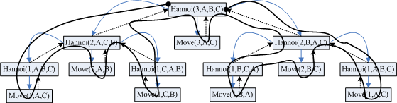

##  Tower of Hanoi (汉诺塔问题)

### 汉诺塔问题

- 有三根柱子（A、B、C），在柱子A上有若干不同大小的圆盘，从上到下按大小顺序排列。
- 目标是将所有圆盘从柱子A移到柱子C，并满足以下规则：
  1. 每次只能移动一个圆盘
  2. 大圆盘不能放在小圆盘上

### reduction & base case

对于汉诺塔问题：

原问题：将 \(n\) 个圆盘从柱子 A 移动到柱子 C
归纳假设：将 \(n-1\) 个圆盘从柱子 A 移动到柱子 B(或C，由对称性)

将原问题归约到归纳假设，有：
1. 将 \(n-1\) 个圆盘从 A 移动到 B（借助 C）
2. 将第 \(n\) 个圆盘从 A 移动到 C
3. 将 \(n-1\) 个圆盘从 B 移动到 C（借助 A）

至此，问题已经基本解决！下面只需要考虑base case即可：

而对只有一个圆盘的情况，直接移动即可(base case)

### 递归实现：

```c
#include <stdio.h>

void hanoi(int n, char from, char to, char aux) {
    printf("hanoi(%d, %c, %c, %c)\n", n, from, to, aux);
    if (n == 1) { // base case: 当只有一个圆盘时，直接移动
        printf("Move disk %d from %c to %c\n", n, from, to);
        return;
    }
    // divide/reduction: 将 n-1 个圆盘从 from 移到 aux，（借助 to）
    hanoi(n - 1, from, aux, to);
    // delegate: 将第 n 个圆盘从 from 移到 to, 这里的“操作”在形式上是移动圆盘
    printf("Move disk %d from %c to %c\n", n, from, to);
    // divide/reduction: 将 n-1 个圆盘从 aux 移到 to，（借助 from）
    hanoi(n - 1, aux, to, from);
}

int main() {
    int n;
    printf("number of disks: ");
    scanf("%d", &n);
    hanoi(n, 'A', 'C', 'B'); // 从 A 移到 C，（借助 B）
    return 0;
}
```

```
number of disks: 3

hanoi(3, A, C, B)
hanoi(2, A, B, C)
hanoi(1, A, C, B)
Move disk 1 from A to C
Move disk 2 from A to B
hanoi(1, C, B, A)
Move disk 1 from C to B
Move disk 3 from A to C
hanoi(2, B, C, A)
hanoi(1, B, A, C)
Move disk 1 from B to A
Move disk 2 from B to C
hanoi(1, A, C, B)
Move disk 1 from A to C
```

### 进一步：构建递归树

对比上面程序的输出与下图中对递归树的遍历（黑色的线），我们可以看到在程序执行过程中，递归的执行过程（或递归树的遍历过程）



### 时间复杂度

汉诺塔问题每次递归将 \(n\) 个圆盘分解为两个规模为 \(n-1\) 的子问题，因此有
\[
T(n) = 2T(n-1) + O(1)
\]
通过递归展开，可得时间复杂度为：
\[
T(n) = O(2^n)
\]
汉诺塔问题的时间复杂度随圆盘数量呈指数增长

### sources and readings

- [Hello 算法 - 汉诺塔问题](https://www.hello-algo.com/chapter_divide_and_conquer/hanota_problem/#3)
- [Algorithms](https://jeffe.cs.illinois.edu/teaching/algorithms/)