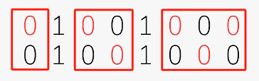

## Exercises - Comprehensive

### 序列最小差

#### 描述：

给定一个包含 $m$ 个整数的数组，要求计算该数组中任意两数之间差的绝对值的最小值。

#### 输入：

1. 第一行输入一个整数 $m$，表示数组的长度（$2 \leq m \leq 1000$）。
2. 第二行输入 $m$ 个整数，表示数组中的元素，每个整数的范围在 $-1000$ 到 $1000$ 之间。

#### 输出：

一个整数，表示数组中任意两数之间差的绝对值的最小值。

#### 解题思路：

1. 使用**暴力穷举法**计算最小差：遍历数组中的所有数对，计算差的绝对值并比较，取最小值。
2. 可以优化为**排序法**：将数组排序后，只需比较相邻元素之间的差即可得到最小差，这样可以提高效率。

#### 样例输入：

```
5
3 8 15 1 9
```

#### 样例输出：

```
1
```

思路1、暴力穷举法：n个数两两做差，取最小值。  
思路2、排序法：先将数组排序，再两两做差，取最小值。

#### 示例代码：

```c
#include <stdio.h>
#include <stdlib.h>

int main() {
    int m; // 输入的m
    scanf("%d", &m);
    int a[m];
    for (int i = 0; i < m; i++)
        scanf("%d", &a[i]);

    int min = 1000;
    for (int i = 0; i < m - 1; i++) {
        for (int j = i + 1; j < m; j++) {
            int tmp = abs(a[i] - a[j]);
            if (tmp < min)
                min = tmp;
        }
    }
    printf("%d", min);

    system("pause");
    return 0;
}
```

### Triangle

#### 描述：

给定一个包含 $n$ 个正整数的数组，这些整数表示若干条线段的长度。请在这些线段中选择三条线段组成一个三角形，并使该三角形的周长最大。如果无法组成三角形，则输出 0。

#### 输入：

1. 第一行输入一个整数 $n$，表示数组的长度（$3 \leq n \leq 1000$）。
2. 第二行输入 $n$ 个正整数，表示线段的长度。

#### 输出：

一个整数，表示所能组成的最大周长的三角形。如果无法组成三角形，输出 0。

#### 解题思路：

1. 首先对数组中的线段长度从大到小排序，这样可以优先尝试最长的三条线段来组成最大周长的三角形。
2. 排序后，从最大处开始依次检查连续的三个线段 $a[i], a[i+1], a[i+2]$ 是否满足三角形不等式：
$$
a[i] < a[i+1] + a[i+2]
$$
3. 如果满足该条件，则它们的和就是最大的周长，输出其周长并结束。
4. 若遍历完数组仍未找到满足条件的三角形，则输出 0。

#### 样例输入：

```
5
2 3 4 5 10
```

#### 样例输出：

```
12
```

#### 思路

1. 因为要取最大值，所以先对数组排序，从最大处开始判断。  
2. 三角形三条边从大到小，按下标排序为$i$、$i+1$、$i+2$，若满足 $i <(i+1)+(i+2)$ 或者， $i -(i+1) < (i+2)$，则满足；如果不满足，下标右移，重新判断。

#### 示例代码：

```c
#include <stdio.h>
#include <stdlib.h>
#include <math.h>

int main() {
    int n; // 输入
    scanf("%d", &n);
    int a[n];
    for (int i = 0; i < n; i++)
        scanf("%d", &a[i]);
    for (int i = 0; i < n - 1; i++) // 数组排序
        for (int j = 0; j < n - i - 1; j++)
            if (a[j] < a[j + 1]) {
                int temp;
                temp = a[j];
                a[j] = a[j + 1];
                a[j + 1] = temp;
            }
    int max = 0;
    for (int i = 0; i < n - 2; i++)
        if (a[i] - a[i + 1] < a[i + 2]) {
            max = a[i] + a[i + 1] + a[i + 2];
            break;
        }
    printf("%d", max);

    system("pause");
    return 0;
}
```

### 统计各个年级的某个姓的同学并且排序

#### 描述：  

给定一个包含学生信息的列表，每行包含学生的学号、姓和名。你需要统计指定姓氏的同学，并按学号中表示的年级从小到大进行排序，然后输出各个年级中该姓氏的学生人数。

学号的前四位表示入学年份。例如，学号 `20220001` 表示该学生入学年份为 2022 年。

#### 输入：

1. 第一行输入一个整数 $n$ 和一个字符串 $last\_name$，表示学生总人数和要统计的姓（$1 \leq n \leq 1000$，姓氏不超过 60 个字符）。
2. 接下来 $n$ 行，每行包含一个整数 $xuehao$ 和两个字符串 $a$ 和 $b$，分别表示学生学号、姓和名。

#### 输出：

按年级从小到大依次输出指定姓氏的学生人数。若无该姓氏的同学，则输出 `NONE`。

#### 解题思路：

1. 遍历每行输入数据，若姓与指定的 $last\_name$ 匹配，则将学号存入数组 `jieguo` 中。
2. 对数组 `jieguo` 按年级（学号的前四位）从小到大排序。
3. 遍历排序后的数组，统计并输出每个年级中该姓的学生人数。

#### 样例输入：

```
5 Wang
20220001 Wang Ming
20210002 Zhang Wei
20220003 Wang Li
20230004 Wang Hua
20210005 Li Lei
```

#### 样例输出：

```
2022 2
2023 1
```

#### 思路

1. 逐行输入学号+姓名后，进行判断（`strcmp`函数），若是该“姓”的同学，则存入数组中
2. 题目要求按照年度从小到大进行排序，故对数组进行排序
3. 累计计算每个年度的人数并输出

```c
#include <stdio.h>
#include <stdlib.h>
#include <string.h>

int main() {
    int n;
    char last_name[61];
    scanf("%d %s", &n, last_name);
    int jieguo[100];
    int j = 0;
    for (int i = 0; i < n; i++) { // 每行输入并比较
        int xuehao;
        char a[61], b[61];
        scanf("%d %s %s", &xuehao, a, b);
        if (strcmp(a, last_name) == 0) {
            jieguo[j] = xuehao;
            j++;
        }
    }

    for (int x = 0; x < j - 1; x++) { // 年级排序
        for (int y = 0; y < j - x - 1; y++) {
            if (jieguo[y] > jieguo[y + 1]) {
                int temp;
                temp = jieguo[y];
                jieguo[y] = jieguo[y + 1];
                jieguo[y + 1] = temp;
            }
        }
    }

    int tag = 0, num = 1;
    for (int x = 0; x < j - 1; x++) {
        if (jieguo[x] == jieguo[x + 1])
            num++;
        else {
            printf("%d %d\n", jieguo[x], num);
            tag++;
            num = 1;
        }
    }
    
    if (tag == 0)
        printf("NONE");
    else
        printf("%d %d\n", jieguo[j - 1], num);

    return 0;
}
```

#### 代码说明：
- **学号排序**：将 `jieguo` 按学号升序排序，以确保年级从小到大排列。
- **统计输出**：按年级输出每个年级中该姓氏的学生人数。

### 社交距离

#### 描述：  
在一个有 $n$ 行 $m$ 列的座位矩阵中，使用社交距离的原则安排座位。座位之间需要过道隔开，每行可以使用过道将可坐的座位分组。你的任务是计算在满足社交距离的情况下，整个座位矩阵中最大可以坐多少人。

#### 输入：
第一行输入两个整数 $n$ 和 $m$，分别表示行数和列数（$1 \leq n, m \leq 100$）。
接下来的 $n$ 行，每行包含 $m$ 个整数，每个整数为 0 或 1，表示该位置的状态：
0 表示可坐的座位。
1 表示过道（不可坐）。

#### 输出：
一个整数，表示在社交距离下整个矩阵中可以坐的最大人数总和。

#### 解题思路：

#### 思路：
1. 以每两行为例，以过道为间隔分组，每组可坐每一行的总座位数

1. 偶数行，可以直接累加$\text{座位数} \times (n/2)$；奇数行，需再累加每行的最大容纳人数

#### 示例代码
```c
#include <stdio.h>
#include <stdlib.h>

int main() {
    int n, m;
    scanf("%d %d", &n, &m);
    int a[n][m];
    for (int i = 0; i < n; i++)
        for (int j = 0; j < m; j++)
            scanf("%d", &a[i][j]);

    int num = 0, sum = 0, tmp = 0; // 以过道为间隔分组，num是每组的座位数；tmp记录每行的最大容纳人数
    for (int i = 0; i < m; i++) {
        if (a[0][i] == 0)
            num++;
        if (a[0][i] == 1 || i == m - 1) {
            tmp += (num + 1) / 2;
            sum += num * (n / 2);
            num = 0;
        }
    }

    if (n % 2 == 0)
        printf("%d", sum);
    else if (n % 2 == 1)
        printf("%d", sum + tmp);

    return 0;
}
```

### K近邻算法

#### 描述：
给定一组已知类别的样本点以及一个待分类样本点，使用K近邻算法判断待分类样本点所属的类别。

#### 输入：
1. 第一行输入两个整数 $m$ 和 $k$，分别表示类别总数和所需的最邻近样本数（$1 \leq m \leq 100$，$1 \leq k \leq 100$）。
2. 接下来是 $m$ 组数据，每组数据首先是一个整数 $n$（表示该类别的样本数量），然后是 $n$ 对整数 $(x, y)$，表示该类别下的样本点的坐标。
3. 最后一行输入两个整数 $x_0$ 和 $y_0$，表示待分类样本点的坐标。

#### 输出：
一个整数，表示待分类样本点所属的类别编号（1到$m$之间的一个数）。

#### 样例输入：
```
3 4
2 1 2 2 1
3 3 3 4 4 5 5
4 6 6 7 7 8 8 9 9
5 5
```

#### 样例输出：
```
2
```

#### 解题思路：
1. 使用四维数组存储已知样本点信息，包含类别编号、坐标点以及到待分类样本点的距离。
2. 对所有样本点按距离排序，若距离相同则按类别编号排序。
3. 找到距离待分类样本点最近的 $k$ 个样本，统计其中每个类别的出现次数。
4. 如果类别之间存在相同的数量，则选择类别编号最小的类别作为分类结果。

#### 特别说明
1. 如果待分类样本到两个点的距离D相同，那么它跟类别编号小的那个样本更相近
2. 如果最相似第 $ k+1, k+2, \dots , k+j $ 样本到待分类样本的距离等于最相似的第$k$个样本到待分类样本的距离，那么确定待分类样本的类别是需要考虑这$j$个样本
3. 与待分类样本最相似的$k$个样本中无法找到一个唯一的大多数所属的类别，则认为相同的大多数类别中类别编号小的那个类别为待分类样本所属的类别。例如$k = 4$时，如果发现$ k $个最相似的样本有2个来自`类别1`，另外2个来自`类别2`，则将待分类样本划分为`类别1`
4. 样本总数小于k时，考虑所有样本

#### 示例代码

```c
#include <stdio.h>
#include <stdlib.h>

int main() {
    int m, k;
    scanf("%d%d", &m, &k);
    int n, a[10000][4] = {0}, count = 0;
    // n是每行第一个数字；四维数组a分别记录类别号、坐标点、距离；数组b记录;count记录所有的样本数

    for (int i = 0; i < m; i++) {
        scanf("%d", &n);
        for (int j = 0; j < n; j++) {
            scanf("%d%d", &a[count][1], &a[count][2]);
            a[count++][0] = i;
        }
    }
    int x0, y0;
    scanf("%d%d", &x0, &y0);
    for (int i = 0; i < count; i++)
        a[i][3] = (a[i][1] - x0) * (a[i][1] - x0) + (a[i][2] - y0) * (a[i][2] - y0);
    int ex;
    for (int i = 1; i < count; i++)
        for (int j = i - 1; j >= 0; j--)
            if (a[j][3] > a[j + 1][3]) { // 冒泡排序（按距离降序，距离相同按类别号降序）
                ex = a[j][0];
                a[j][0] = a[j + 1][0];
                a[j + 1][0] = ex;
                ex = a[j][3];
                a[j][3] = a[j + 1][3];
                a[j + 1][3] = ex;
            } else if (a[j][3] == a[j + 1][3] && a[j][0] > a[j + 1][0]) {
                ex = a[j][0];
                a[j][0] = a[j + 1][0];
                a[j + 1][0] = ex;
            }
    if (count < k) // 样本总数小于k时，考虑所有样本
        k = count;
    int num = k; // num记录最邻近样本个数
    if (k != count) { // 第k个之后的多个样本到待分类样本的距离==最相似的第k个样本到待分类样本的距离时，都考虑
        for (num = k; num < count; num++)
            if (a[num][3] > a[k - 1][3])
                break;
    }
    int b[100] = {0}, max0 = 0;
    for (int i = 0; i < num; i++) // 每类满足要求的个数
        b[a[i][0]]++;
    for (int i = 0; i < m; i++) // 共m组类别，找出最大值
        if (b[i] > max0)
            max0 = b[i];
    for (int i = 0; i < m; i++) // 输出最大值
        if (b[i] == max0) {
            printf("%d", i + 1);
            break;
        }

    system("pause");
    return 0;
}
```
