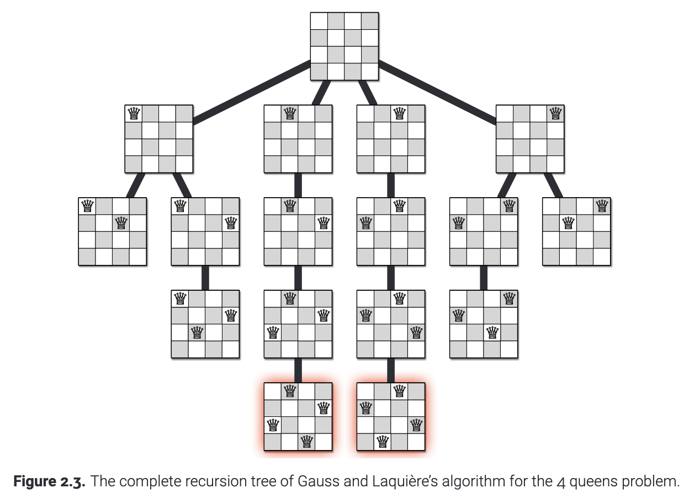
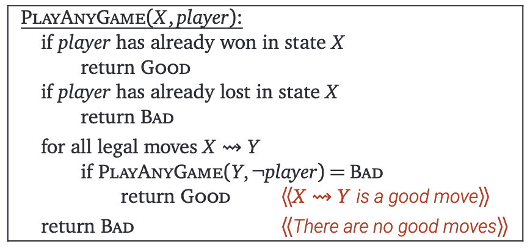
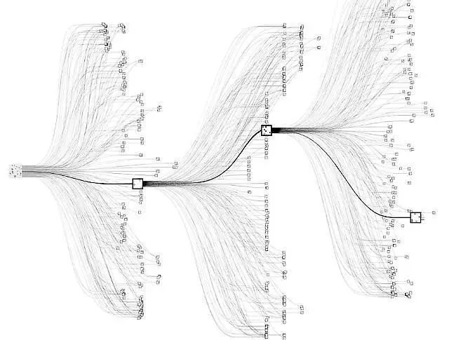
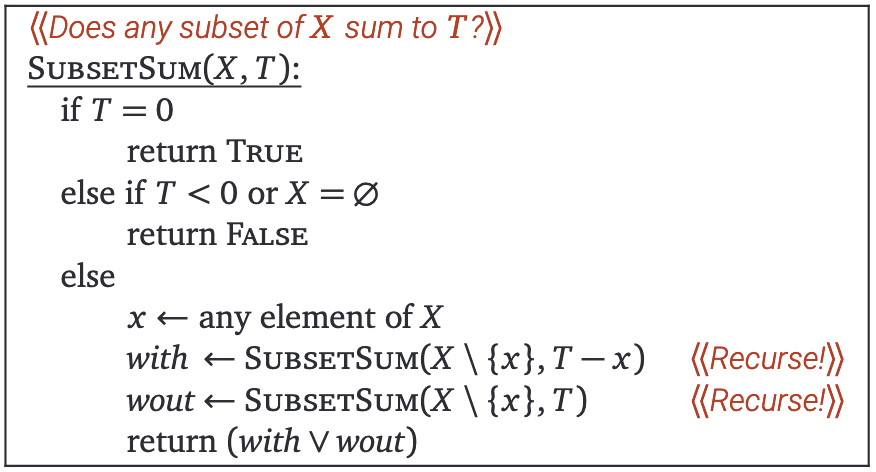
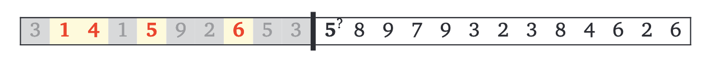
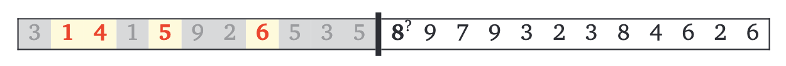
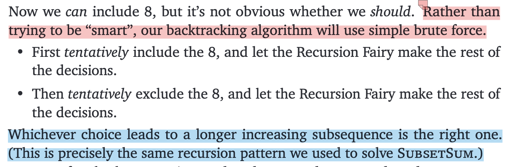
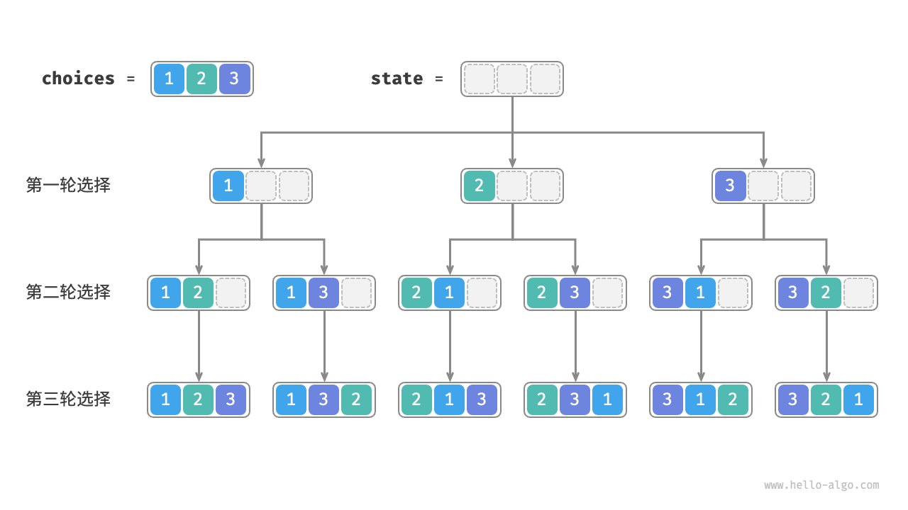

## Backtracking

> "A backtracking algorithm tries to construct a solution to a computational problem incrementally, one small piece at a time. **Whenever the algorithm needs to decide between multiple alternatives to the next component of the solution, it recursively evaluates every alternative and then chooses the best one.**"
-- <cite>Algorithms, by Jeff Erickson</cite>

> "之所以称之为回溯算法，是因为该算法在搜索解空间时会采用“尝试”与“回退”的策略。当算法在搜索过程中遇到某个状态无法继续前进或无法得到满足条件的解时，它会撤销上一步的选择，退回到之前的状态，并尝试其他可能的选择。"
> **值得说明的是，回退并不仅仅包括函数返回。**
-- <cite>Hello 算法</cite>

## Some Examples:

### N-Queens (n皇后问题)

```c
void PlaceQueens(int Q[], int r, int n) {
    // Q: Q[r] = j means placing a queen in row r and column j
    // r: the current row, 1 <= r <= n
    // n: total number of queens
    if (r == n + 1) {
        printSolution(Q, n);
    } else {
        for (int j = 1; j <= n; j++) {
            bool legal = true;
            // Check all previously placed queens
            for (int i = 1; i < r; i++) {
                if (Q[i] == j || Q[i] == j + r - i || Q[i] == j - r + i) {
                    //same column || major diagonal || minor diagonal
                    legal = false;
                    break;
                }
            }
            if (legal) {
                Q[r] = j;
                PlaceQueens(Q, r + 1, n);
            }
        }
    }
}
```



[full code](../../code/examples/nqueen.c)

### Game Tree (博弈树)

```
             | | | |
             | | | |
             | | | |

    | | | |  | | | |  | | | |
... |x| | |  | |x| |  | | |x| ...
    | | | |  | | | |  | | | |

             ... ...

             |x|x|o|
... ... ...  |o|x|o|  ... ... ...
             |x|o|x|
```



>"All game-playing programs are **ultimately** based on this simple backtracking strategy. However, since most games have an enormous number of states, it is not possible to traverse the entire game tree in practice. Instead, game programs employ other heuristics to **prune the game tree**, by ignoring states that are obviously (or “obviously”) good or bad, or at least better or worse than other states, and/or by cutting off the tree at a certain depth (or *ply*) and using a more efficient heuristic to evaluate the leaves."



### Subset Sum (子集和问题)

> **SubsetSum**: Given a set $X$ of positive integers and target integer $T$, is there a subset of elements in $X$ that add up to $T$?

我们考虑集合 \(X\) 中的任意元素 \(x\).（\(X\) 为空的情况显然）要判断是否存在一个子集使得其元素和为 \(T\)，当且仅当以下两个条件之一成立：

- 存在包含元素 \(x\) 的子集，其元素和为 \(T\)
- 存在不包含元素 \(x\) 的子集，其元素和为 \(T\)

（即，可能满足条件的子集要么包含 \(x\)，要么不包含 \(x\)）



```c
bool subsetSum(int X[], int n, int T) {
    // Base cases
    if (T == 0) return true;
    if (T < 0 || n == 0) return false;

    int x = X[n-1]; // 每次任意选择元素 x 遍历 X 即可，这里选择最后一个元素

    bool with = subsetSum(X, n-1, T - x); // x is included
    bool wout = subsetSum(X, n-1, T); // x is excluded

    return with || wout;
}
```

[full code](../../code/examples/subset_sum1.c)

## 总结

回溯算法通常用于**构建满足特定约束**的**递归定义结构**，目标通常是一个**序列**（能够发现或者将问题转化成序列很重要），例如：
- n皇后问题：寻找皇后的位置序列，使得<span style="color:#F08080">每行</span>的皇后互不攻击
- 博弈树问题：寻找移动序列，使<span style="color:#F08080">每一步</span>对当前玩家最优。
- 子集和问题：<span style="color:#F08080">逐个</span>元素遍历，寻找元素的序列，使得它们的和等于目标值。

回溯算法的核心是**每次递归调用只做<span style="color:#F08080">一个</span>决策**，**并确保当前决策与之前的决策一致**，同时为了提高效率，需要对之前的决策进行简化总结：
- n皇后问题：需要记录所有已放置皇后的位置
- 博弈树问题：只需记录当前游戏状态，与过去的决策无关
- 子集和问题：只需记录剩余的目标值和未处理的元素集合，已选择的元素具体内容无关紧要

设计回溯算法时，关键在于**提前确定需要记录哪些过去的决策信息**。如果需要记录的信息复杂，可能需要**解决一个比原问题更通用的问题**

最后，通过递归暴力搜索解决问题：尝试所有可能的决策，不跳过任何看似“愚蠢”的选择，优化可以留到之后再做。

<span style='color:#F08080'> <b>first make it work, then make it fast.</b></span>

## More Examples

### Longest Increasing Subsequence (最长递增子序列)

Suppose we are given a sequence of integers, and we need to find the longest subsequence whose elements are in increasing order.

More concretely, the input is an integer array $ A[1 \dots n] $ , and we need to compute the longest possible sequence of indices $ 1 \leq i_1 < i_2 < \cdots < i_\ell \leq n $ such that  $A[i_k] < A[i_{k+1}] $ for all  $k$.

一个自然的想法：对于每个索引 $j$，我们可以选择是否将 $A[j]$ 包含在子序列中





```c
// Recursive function to find the LIS with 'prev' as the last included element
int LISBigger(int prev, int A[], int n) {
    if (n == 0) return 0;

    if (A[0] <= prev) {
        // Skip the current element if it's not greater than 'prev'
        return LISBigger(prev, A + 1, n - 1);
    } else {
        // two cases: skipping or taking the current element
        int skip = LISBigger(prev, A + 1, n - 1);
        int take = LISBigger(A[0], A + 1, n - 1) + 1;
        return (skip > take) ? skip : take; // max(skip, take)
    }
}
```

[full code](../../code/examples/lis.c)

### Text Segmentation (分词)

Given a string of characters, can it be segmented into English words at all?
More concretely, let’s assume we have access to a subroutine `IsWord(w)` that takes a string `w` as input, and returns `True` if `w` is a “word”, or `False` if `w` is not a “word”.

### Maze (迷宫问题)

返回迷宫中所有可能的路径

```c
void go(int x, int y) {
    // 边界条件和障碍物处理
    if (x < 0 || y < 0 || x >= n || y >= m || maze[x][y] == 0 || fp[x][y] == 1) 
        return;

    // 如果到达终点，记录路径
    if (x == n - 1 && y == m - 1) {
        current_path[current_length][0] = x;
        current_path[current_length][1] = y;
        current_length++;

        // 保存当前路径
        for (int i = 0; i < current_length; i++) {
            paths[path_count][i][0] = current_path[i][0];
            paths[path_count][i][1] = current_path[i][1];
        }
        path_count++;

        current_length--;
        return;
    }

    // 标记当前位置
    fp[x][y] = 1;
    current_path[current_length][0] = x;
    current_path[current_length][1] = y;
    current_length++;

    // 四个方向递归
    go(x + 1, y); // 向下
    go(x, y + 1); // 向右
    go(x - 1, y); // 向上
    go(x, y - 1); // 向左

    // 回溯
    fp[x][y] = 0;
    current_length--;
}
```
[full code](../../code/examples/maze/maze_all_paths.c)

- [x] 126 Travel

```c
void travel(int x, int y) {
    if (x < 1 || y < 1 || x > n || y > m || fp[x][y]) return;
    fp[x][y] = 1;
    sumt += map[x][y];
    
    if (x == n && y == m) {
        maxt = sumt > maxt ? sumt : maxt;
    } else {
        travel(x, y + 1); // 右
        travel(x + 1, y); // 下
        travel(x, y - 1); // 左
    }
    
    // 回溯
    fp[x][y] = 0;
    sumt -= map[x][y];
}
```
[full code](../../code/examples/maze/126.c)

### Permutation (排列问题)

全排列问题是回溯算法的一个典型应用：在给定一个集合（如一个数组或字符串）的情况下，找出其中元素的所有可能的排列



```c
void generatePermutations(int arr[], int n, int depth) {
    if (depth == n) {
        printPermutation(result, n);
        return;
    }

    for (int i = 0; i < n; i++) {
        if (used[i]) continue;
        // 用于生成无重复的排列：如果当前元素与前一个元素相同且前一个元素尚未被使用，则跳过，arr已排序
        if (i > 0 && arr[i] == arr[i - 1] && !used[i - 1]) continue;

        used[i] = true;
        result[depth] = arr[i];

        generatePermutations(arr, n, depth + 1);

        // 回溯
        used[i] = false;
    }
}
```

[full code](../../code/examples/permutation/permutation.c)

<span style="color:#F08080">从递归树的角度来看，每个叶子节点都对应一个排列，不同的条件是对树的不同剪枝操作</span>

关于
```c
if (i > 0 && arr[i] == arr[i - 1] && !used[i - 1]) continue;
```

当 `arr[i]` 与 `arr[i - 1]` 是重复的元素时，如果 `arr[i - 1]` 并未在当前生成分支中被选用（`used[i - 1] == false`），那么直接选择 `arr[i]` 会导致我们把相同的元素排列（重复值在相同位置）生成多次（即在同一层决策时跳过了第一个重复元素却选择了第二个重复元素）

假设有重复元素数组 `arr = [1,1,2]` （已排序）。在选取第一个元素时，有两种选择分别是第一个1和第二个1，如果不加控制条件，就会对两个 1 都尝试相同的选择路径，如：
- 选第一个 1 开头然后生成的排列 (例如 `[1,1,2]` 和 `[1,2,1]`)
- 选第二个 1 开头时，又会重复生成出同样的 `[1,1,2]` 和 `[1,2,1]` 的排列（选择第二个 1 和选择第一个 1 是等价的）

加入判断条件后，当尝试在同一层级去选择第二个 1 时，会因为 `!used[i-1]` 条件（即第一个 1 没用过）被跳过

关于全排列问题，可以参考 [Hello 算法 - 全排列问题](https://www.hello-algo.com/chapter_backtracking/permutations_problem)

#### related problems

- [x] 125 行列式计算

```c
void calculateDeterminant(int depth) {
    // 用定义计算，所有行排列的对角线乘积*符号求和
    if (depth == n) {
        int inversions = countInversions(permutation, n); // 计算逆序数
        int sign = (inversions % 2 == 0) ? 1 : -1; // 根据逆序数确定符号
        int product = sign; // 计算排列对应的乘积

        for (int i = 0; i < n; i++) {
            product *= matrix[i][permutation[i]];
        }

        det += product;
        return;
    }

    for (int i = 0; i < n; i++) {
        if (!used[i]) {
            used[i] = true;
            permutation[depth] = i;
            calculateDeterminant(depth + 1);
            used[i] = false;
        }
    }
}
```

[full code](../../code/examples/permutation/125.c)

- [x] 143 数列合并

```c
void findPermutation(int depth) {
    if (depth == n) {
        // 当生成一个完整的排列时，计算最终合并的结果
        if (calculateSum(currentPermutation, n) == targetSum) {
            if (!foundSolution) {
                // 输出满足条件的第一个排列（字典序最小）
                for (int i = 0; i < n; i++) {
                    if (i > 0) printf(" ");
                    printf("%d", currentPermutation[i]);
                }
                printf("\n");
                foundSolution = true; // 标记已找到解
            }
        }
        return;
    }

    for (int i = 1; i <= n; i++) {
        if (!used[i] && !foundSolution) {
            used[i] = true;
            currentPermutation[depth] = i;
            findPermutation(depth + 1);
            used[i] = false;
        }
    }
}
```

[full code](../../code/examples/permutation/143.c)

- [x] 202 分书问题

```c
void findAllocations(int person) {
    if (person == n) {
        // 所有人的书都已分配
        totalSolutions++;
        for (int i = 0; i < n; i++) {
            printf("B%d", allocation[i] + 1);
        }
        printf("\n");
        return;
    }

    for (int book = 0; book < n; book++) {
        // 已分配，或者不喜欢
        if (used[book] || preference[person][book] == 0) continue;

        used[book] = true; // 分配书给当前人
        allocation[person] = book;
        findAllocations(person + 1);
        used[book] = false; // 回溯，撤销分配
    }
}
```

[full code](../../code/examples/permutation/202.c)

- [x] 247 匹配Wild号码

```c
// 递归生成所有可能的数字组合
void generateNumbers(const char* wild, char* current, int pos, int* count, const char* W) {
    int length = strlen(wild);
    if (pos == length) {
        // 已经生成一个完整的数字，检查是否满足条件
        if (strcmp(current, W) > 0) {
            (*count)++;
        }
        return;
    }

    if (wild[pos] == '?') {
        // 如果当前字符是 '?', 尝试替换成 '0' 到 '9'
        for (char c = '0'; c <= '9'; c++) {
            current[pos] = c;
            generateNumbers(wild, current, pos + 1, count, W);
        }
    } else {
        // 如果当前字符不是 '?', 直接复制
        current[pos] = wild[pos];
        generateNumbers(wild, current, pos + 1, count, W);
    }
}
```
[full code](../../code/examples/permutation/247.c)

- [x] 680 棍子的长度
```c
bool backtrack(int currentLen, int stickCount, int index) {
    // 如果已经完成所有的棍子
    if (stickCount == totalSum / targetLen) {
        return true;
    }

    // 如果当前棍子的长度完成，开始下一根
    if (currentLen == targetLen) {
        return backtrack(0, stickCount + 1, 0);
    }

    // 尝试选择棍子
    for (int i = index; i < n; i++) {
        if (used[i]) continue; // 跳过已用棍子
        if (currentLen + sticks[i] > targetLen) continue; // 棍子太长

        // 避免重复组合
        if (i > 0 && sticks[i] == sticks[i - 1] && !used[i - 1]) continue;

        used[i] = true;
        if (backtrack(currentLen + sticks[i], stickCount, i + 1)) {
            return true;
        }
        used[i] = false;

        // 剪枝：如果当前组合失败，后续相同长度的棍子也会失败
        if (currentLen == 0 || currentLen + sticks[i] == targetLen) {
            return false;
        }
    }
    return false;
}
```
[full code](../../code/examples/permutation/680.c)

#### next_permutation

`next_permutation` 是 C++ 标准库中用于**生成序列的字典序下一排列**的函数。它会对给定范围内的元素重新排列，使其变为当前排列的下一个字典序排列。如果当前排列已经是字典序的最后一个排列（即递减序列），则将其变为字典序的第一个排列（即递增序列）。是一种高效生成排列的方法，适合在需要按字典序枚举时使用。

**函数定义**

```c
bool next_permutation(BidirectionalIterator first, BidirectionalIterator last);
```

**参数**
- `first` 和 `last`：标志序列范围的两个迭代器

**返回值**
- `true`：如果成功生成了下一个排列。
- `false`：如果当前排列是字典序最后一个排列。

**使用**

生成全排列

```cpp
#include <iostream>
#include <algorithm>
#include <vector>

using namespace std;

int main() {
    vector<int> nums = {1, 2, 3}; // 初始序列
    
    // 按字典序生成全排列
    do {
        for (int num : nums) {
            cout << num << " ";
        }
        cout << endl;
    } while (next_permutation(nums.begin(), nums.end()));

    return 0;
}
```

```
1 2 3
1 3 2
2 1 3
2 3 1
3 1 2
3 2 1
```