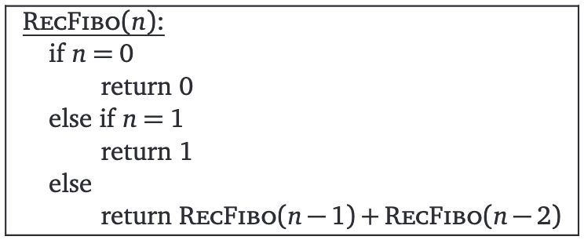
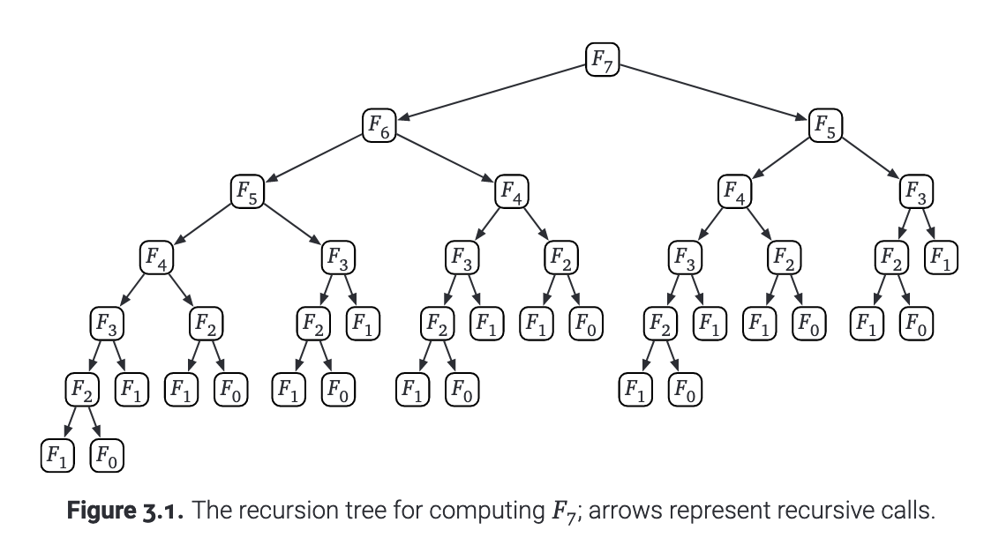
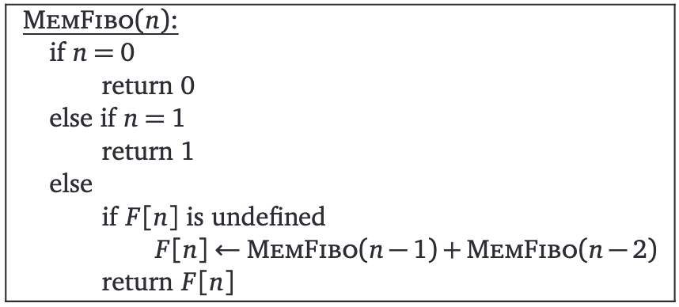
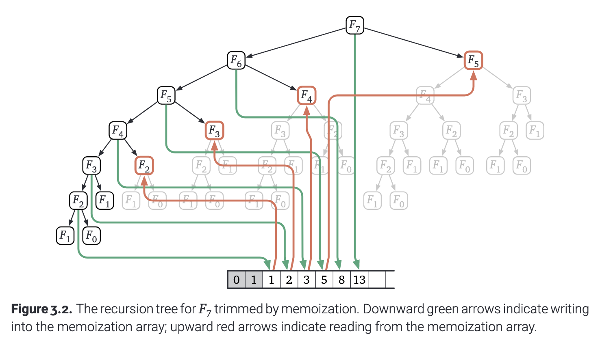
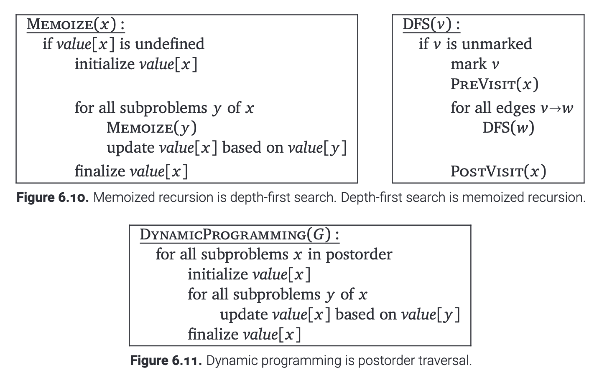

## Dynamic Programming

>"Those who cannot remember the past are condemned to repeat it."
<cite>Jorge Agustín Nicolás Ruiz de Santayana y Borrás, The Life of Reason, Book I: Introduction and Reason in Common Sense (1905)
</cite>

<span style="color:#F08080">强烈推荐 [Algorithms](https://jeffe.cs.illinois.edu/teaching/algorithms) 中 [Recursion](http://jeffe.cs.illinois.edu/teaching/algorithms/book/03-dynprog.pdf) 部分，下面的讨论很多来自这里</span>

### Fibonacci Sequence(斐波那契数列)

在前面的 Recursion 部分中，我们探讨了斐波那契数列的两种实现方式：递归和递推，下面我们从递归树的角度再来审视，并且引入记忆化搜索和动态规划

#### Recursion (递归)



```c
int RecFibo(int n) {
    if (n == 0) {
        return 0; // Base case: F(0) = 0
    } else if (n == 1) {
        return 1; // Base case: F(1) = 1
    } else {
        return RecFibo(n - 1) + RecFibo(n - 2);
    }
}
```



#### Memoization (记忆化搜索)



```c
int MemoFibo(int n, int* memo) {
    if (n == 0) {
        return 0; // Base case: F(0) = 0
    } else if (n == 1) {
        return 1; // Base case: F(1) = 1
    }
    if (memo[n] != -1) {
        return memo[n]; // If already computed, return memoized result
    }
    // Compute and store result in memo array
    memo[n] = MemoFibo(n - 1, memo) + MemoFibo(n - 2, memo);
    return memo[n];
}
```



可以发现，记忆化搜索在递归的基础上做了“剪枝”操作，避免了大量重复计算

#### Dynamic Programming (动态规划)

```c
int DPFibo(int n) {
    if (n == 0) {
        return 0; // Base case: F(0) = 0
    }
    if (n == 1) {
        return 1; // Base case: F(1) = 1
    }
    // 用数组存储中间结果
    int dp[n + 1];
    dp[0] = 0; // 初始化 F(0)
    dp[1] = 1; // 初始化 F(1)
    for (int i = 2; i <= n; i++) {
        dp[i] = dp[i - 1] + dp[i - 2];
    }
    return dp[n];
}
```

可以发现，动态规划具有"Bottom-Up"(“自底向上”)的特点，与递归相比，从base case开始，逐步计算到最终结果，这里需确保每一次计算所需的依赖都已经计算完毕；从递归树的角度来看，动态规划是对递归树中，有相互依赖关系的节点进行的一种自下而上的遍历

|  Technique  |  Approach  |  Time Complexity  |  Space Complexity  |  Redundancy Eliminated  |
|--|--|--|--|--|
|Recursion | Top-Down | $O(2^n)$ | $O(n)$ | ✘ |
|Memoization | Top-Down + Cache | $O(n)$ | $O(n)$ | ✔ |
|Dynamic Programming | Bottom-Up | $O(n)$ | $O(n)^*$ | ✔ |

$^*$ Can be optimized to  O(1)  for Fibonacci.



事实上，记忆化搜索与动态规划本质上是一样的，都是对依赖图的深度优先遍历，后者是后序

### Examples

#### 278 爬楼梯

此问题与斐波那契数列等价

```c
// **递归**
int climbStairsRecursive(int n) {
    if (n == 0 || n == 1) {
        return 1; // 基础情况：只有一种方式爬到第 0 或第 1 个台阶
    }
    return climbStairsRecursive(n - 1) + climbStairsRecursive(n - 2); // 递归关系
}
```

```c
// **记忆化搜索**
int climbStairsMemo(int n, int* memo) {
    if (n == 0 || n == 1) {
        return 1; // 基础情况
    }
    if (memo[n] != -1) {
        return memo[n]; // 如果已经计算过，直接返回
    }
    // 递归计算并保存结果
    memo[n] = climbStairsMemo(n - 1, memo) + climbStairsMemo(n - 2, memo);
    return memo[n];
}
```
```c
// **动态规划实现**
int climbStairsDP(int n) {
    if (n == 0 || n == 1) {
        return 1; // 基础情况
    }
    int dp[n + 1]; // 创建 DP 数组
    dp[0] = 1; // 爬到第 0 个台阶的方式
    dp[1] = 1; // 爬到第 1 个台阶的方式
    for (int i = 2; i <= n; i++) {
        dp[i] = dp[i - 1] + dp[i - 2]; // 状态转移方程
    }
    return dp[n]; // 返回爬到第 n 个台阶的方式
}
```

#### 117 摘桃子

**递归** (78/100, TLE)
```c
#include <stdio.h>

#define MAXN 100 // 树的最大层数

int tree[MAXN][MAXN]; // 存储树上每层的桃子数
int n; // 树的层数

// 递归函数：从第 i 层的第 j 个位置出发，计算最多桃子数
int dfs(int i, int j) {
    if (i > n) {
        return 0; // 超过树的顶部，返回 0
    }

    // 递归计算从下一层左上方和右上方出发的最大值
    int left = dfs(i + 1, j);     // 左上方的路径
    int right = dfs(i + 1, j + 1); // 右上方的路径

    // 返回当前层的桃子数加上下层的最大值
    return tree[i][j] + (left > right ? left : right);
}

int main() {
    // 输入树的层数
    scanf("%d", &n);

    // 输入树的桃子数
    for (int i = 1; i <= n; i++) {
        for (int j = 1; j <= i; j++) {
            scanf("%d", &tree[i][j]);
        }
    }

    // 从树的顶部（第 1 层第 1 个位置）开始递归
    int result = dfs(1, 1);

    // 输出最多桃子数
    printf("%d\n", result);

    return 0;
}
```

---

**记忆化搜索** (100/100)
```c
#include <stdio.h>
#include <cstring>

#define MAXN 100 // 树的最大层数

int tree[MAXN][MAXN]; // 存储树上每层的桃子数
int memo[MAXN][MAXN]; // 记忆化数组，memo[i][j] 表示从第 i 层的第 j 个位置能摘到的最多桃子数
int n; // 树的层数

// 递归函数：从第 i 层的第 j 个位置出发，计算最多桃子数
int dfs(int i, int j) {
    if (i > n) {
        return 0; // 越过了树的顶部，返回 0
    }
    if (memo[i][j] != -1) {
        return memo[i][j]; // 如果已经计算过，直接返回记忆化结果
    }

    // 状态转移：摘当前的桃子数 + 从下一层的左上方或右上方出发的最大值
    int left = dfs(i + 1, j);     // 左上方的路径
    int right = dfs(i + 1, j + 1); // 右上方的路径
    memo[i][j] = tree[i][j] + (left > right ? left : right);

    return memo[i][j];
}

int main() {
    // 输入树的层数
    scanf("%d", &n);

    // 输入树的桃子数
    for (int i = 1; i <= n; i++) {
        for (int j = 1; j <= i; j++) {
            scanf("%d", &tree[i][j]);
        }
    }

    // 初始化记忆化数组
    memset(memo, -1, sizeof(memo));

    // 从树的顶部（第 1 层第 1 个位置）开始递归
    int result = dfs(1, 1);

    // 输出最多桃子数
    printf("%d\n", result);

    return 0;
}
```

---

**动态规划** (100/100)
```c
#include <stdio.h>
#include <cstring>

#define MAXN 100 // 树的最大层数

int tree[MAXN][MAXN]; // 存储树上每层的桃子数
int dp[MAXN][MAXN];   // 动态规划数组，dp[i][j] 表示从第 i 层的第 j 个位置开始能摘到的最多桃子数

int main() {
    int n; // 树的层数
    scanf("%d", &n);

    // 输入树上的桃子数
    for (int i = 1; i <= n; i++) {
        for (int j = 1; j <= i; j++) {
            scanf("%d", &tree[i][j]);
        }
    }

    // 初始化 dp 数组为 0
    memset(dp, 0, sizeof(dp));

    // 动态规划：从树的最后一层开始往上推
    for (int i = 1; i <= n; i++) {
        dp[n][i] = tree[n][i]; // 最底层的最大桃子数就是该层的桃子数本身
    }

    for (int i = n - 1; i >= 1; i--) { // 从倒数第二层开始向上计算
        for (int j = 1; j <= i; j++) {
            // 状态转移方程：dp[i][j] = tree[i][j] + max(dp[i+1][j], dp[i+1][j+1])
            dp[i][j] = tree[i][j] + (dp[i + 1][j] > dp[i + 1][j + 1] ? dp[i + 1][j] : dp[i + 1][j + 1]);
        }
    }

    // dp[1][1] 即为从树顶开始摘到的最多桃子数
    printf("%d\n", dp[1][1]);

    return 0;
}
```

### 🏗️ Work in Progress

#### Subset Sum (子集和问题)
#### Longest Increasing Subsequence (最长递增子序列)
#### Edit Distance (编辑距离)