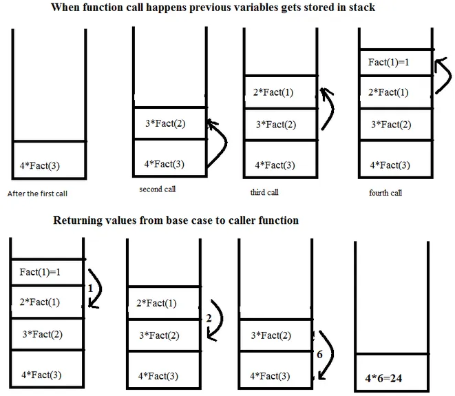
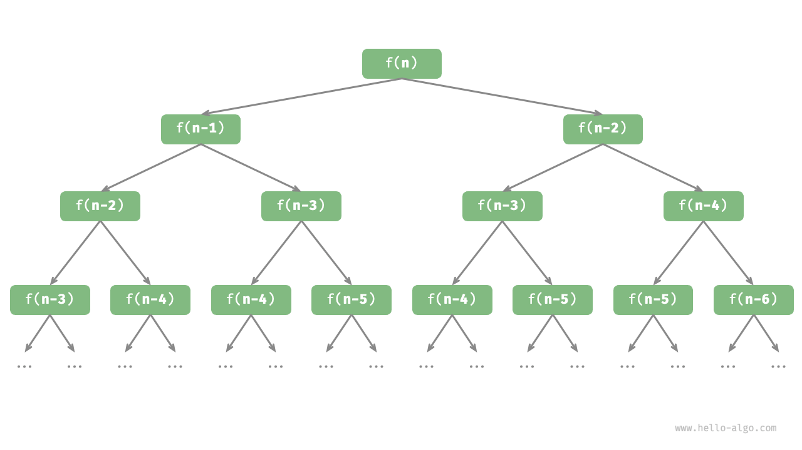

## Recursion

>Do the hard jobs first. The easy jobs will take care of themselves. 
<cite> -- attributed to Dale Carnegie</cite>

强烈推荐 [Algorithms](https://jeffe.cs.illinois.edu/teaching/algorithms/) 中 Recursion 部分，下面的讨论很多来自这里

### MI(Mathematical Induction, 数学归纳法)

> Axiom 2.5 (Principle of mathematical induction). Let $P(n)$ be any property pertaining to a natural number $n$. Suppose that $P(0)$ is true, and suppose that whenever $P(n)$ is true, $P(n++)$ is also true. Then $P(n)$ is true for every natural number $n$.
-- <cite>Analysis I, by Terence Tao</cite>

两步：
1. 证明 “当$n=1$时命题成立”
2. 证明 “若假设在$n=m$时命题成立，可推导出在$n=m+1$时命题成立，$m\in \mathbb{N}$”

在第1步中，我们证明了起始情况(base case)
在第2步中，我们借助归纳假设(inductive hypothesis)，证明了命题

### Reduction

>Reduction is the single most common technique used in designing algorithms. Reducing one problem X to another problem Y means to write an algorithm for X that uses an algorithm for Y as a black box or subroutine. <span style="color:red">Crucially, the correctness of the resulting algorithm for X cannot depend in any way on how the algorithm for Y works. The only thing we can assume is that the black box solves Y correctly</span>.
-- <cite>Algorithms, by Jeff Erickson</cite>

而在递归的上下文中，Reduction（“归约”），是将原问题转化为一个或多个更简单的的同一类问题，同时认为这些简化后的问题可以被解决（从数学归纳法的角度，这里所谓“认为可以被解决的更简化的问题”，就是归纳假设！）；到这里，距离完成这个问题之差一步：base case（即数学归纳法中的“奠基步”、“初始情况”）

可以有下面的直观：
- 递归：通过假设递归调用的结果是正确的，从而解决当前问题。
- 数学归纳：假设命题在规模较小的情况下成立，然后证明其在规模更大的情况下也成立。

很有意义的一个直观：
>When we design algorithms, we may not know exactly how the basic building blocks we use are implemented, or how our algorithms might be used as building blocks to solve even bigger problems. That ignorance is uncomfortable for many beginners, but it is both unavoidable and extremely useful. Even when you do know precisely how your components work, it is often extremely helpful to pretend that you don’t.
-- <cite>Algorithms, by Jeff Erickson</cite>

**示例：$n!$ 的递归定义**

阶乘定义如下：
\[
n! = n \times (n-1) \times \cdots \times 1, \quad n \in \mathbb{N},
\]
规定：
\[
0! = 1.
\]

使用数学归纳法证明其递归定义：
\[
n! = 
\begin{cases} 
1 & \text{if } n = 0, \\
n \times (n-1)! & \text{if } n \geq 1.
\end{cases}
\]

**证明：**

**(Base Case)**
当 \(n = 1\) 时，由定义，\(1! = 1 = 1 \times (1-1)! = 1 \times 0! = 1\)，命题成立

**(Inductive Hypothesis)**
假设当 \(n = k, k \geq 2\) 时命题成立，即：
\[
k! = k \times (k-1)! = k \times (k-1) \times \cdots \times 1
\]

**(Inductive Step)**
当 \(n = k+1\) 时
\[
(k+1)! = (k+1) \times k \times \cdots \times 1 = (k+1) \times k!
\]

与阶乘的定义一致

---

可以根据阶乘的递归定义，自然地写出递归求 $n!$ 的程序：

```c
int factorial(int n) {
    if (n == 1 || n == 0) { // 实际上只需写 n == 0，但为了与数学归纳法表述对应
        return 1;
    } else {
        return n * factorial(n - 1);
    }
}
```

如何来看这样一个递归程序呢？函数`factorial`在“调用自己”时，会假设或相信`factorial(n - 1)`的结果是正确的，然后再乘以`n`，从而得到`factorial(n)`的结果——这时候我们自然地会想“`factorial(n - 1)`内部是怎么执行的？”——<span style="color:red">STOP!</span>——这里在一定程度上可以说是递归的“魔力”所在，但是这样的“相信”并非空想，其正确性是建立数学归纳法的基础上的：
1. `fractional(n-1)`是我们的归纳假设——即我们已经（反向）完成了"inductive step"
2. 我们已经对base case做了正确实现：`if (n == 1 || n == 0) { return 1; }`

### 递归的实现：调用栈(Call Stack)

前面从数学归纳法的角度出发介绍递归，个人认为是更容易理解的方式——尤其是关于如何来读一个递归程序，但是，当涉及到递归内部的操作时，我们需要明确了解递归的内容（从<span style="color:red">STOP!</span>出发）

“递归”在计算机中的实现基于“调用栈(Call Stack)”——即函数调用的栈空间，“栈”是一种线性数据结构，具有“后进先出”的特性(LIFO, Last In First Out)，栈相关的内容可参考[这里](https://www.hello-algo.com/chapter_stack_and_queue/stack/)

暂时不深入讨论调用栈的细节，只需要建立直观：
- 每次函数调用时，会将函数的参数、局部变量等信息压入栈中
- 而当函数返回时，这些信息会被弹出栈

同样使用阶乘的递归程序来说明，使用`printf`展示递归调用栈时**入栈**与**出栈**的过程

**入栈：**

```c
int factorial(int n) {
    if (n == 1 || n == 0) { // 实际上只需写 n == 0，但为了与数学归纳法表述对应
        printf("n = %d, 1\n", n, n);
        return 1;
    } else {
        printf("n = %d, factorial(%d - 1)\n", n, n);
        return n * factorial(n - 1);
    }
}
```
输出：
```
n = 4, factorial(4 - 1)
n = 3, factorial(3 - 1)
n = 2, factorial(2 - 1)
n = 1, 1
```

**出栈：**

```c
int factorial(int n) {
    if (n == 1 || n == 0) { // 实际上只需写 n == 0，但为了与数学归纳法表述对应
        printf("n = %d, 1\n", n);
        return 1;
    } else {
        int output = n * factorial(n - 1);
        printf("n = %d, %d\n", n, output);
        return output;
    }
}
```
输出：
```
n = 1, 1
n = 2, 2
n = 3, 6
n = 4, 24
```

两个程序的输出可参考下图：（注意，“输出”自上而下是入栈、出栈的顺序，不是栈的状态，比如“入栈”程序中，输出的第一行 `n = 4, factorial(4 - 1)` 表示将这些信息入栈，对应下图中第一个图，而非表示其在栈顶）



-- <cite>https://medium.com/@muirujackson/call-stack-recursion-cb6510d1a391</cite>

*将执行次数或执行时间这一维度考虑在内，调用栈的变化如同“上坡”、“下坡”，而所处的“层数”或“高度”表示当前递归的深度*

### 进一步理解：递归树

首先要说明：递归树的表达能力有限，并不是所有递归都是递归树，但递归树是一个理解递归的很好直观、以及分析一些递归算法复杂度的有力工具

树相关的内容可参考[这里](https://www.hello-algo.com/chapter_tree/binary_tree/)

以斐波那契数列为例，其递归定义如下：
\[
f(n) =
\begin{cases}
0 & \text{if } n = 0, \\
1 & \text{if } n = 1, \\
f(n-1) + f(n-2) & \text{if } n \geq 2.
\end{cases}
\]

可以自然地写出递归程序：

```c
int fib(int n) {
    if (n == 1 || n == 2)
        return n - 1;
    int res = fib(n - 1) + fib(n - 2);
    return res;
}
```

此时，如果我们尝试考虑调用栈，会发现，每一个栈帧会被不断地“一分为二”，

```
.................
|_|_|_|_|_|_|_|_|
|___|___|___|___|
|_______|_______|
|_______________|
```

为了更好地抽象出这一过程的逻辑结构，可以使用如下的“递归树”：



递归树可以为一个相对复杂的递归过程提供直观，其实这里可以发现，递归计算斐波那契数列时，存在大量的重复计算，从复杂度的角度来看，其实是有很多优化空间的

### 递推 vs. 递归：一点直观

**strongly recommend**
- [MIT 6.101 Fall 2022: Recursion and Iteration](https://web.mit.edu/6.102/www/sp23/classes/11-recursive-data-types/recursion-and-iteration-review.html#6101_fall_2022_recursion_and_iteration)

- [Hello 算法 - 迭代与递归](https://www.hello-algo.com/chapter_computational_complexity/iteration_and_recursion/?h=递归)

other resources: (threads) 
- [stack overflow - recursion versus iteration](https://stackoverflow.com/questions/15688019/recursion-versus-iteration)
- [Recursion VS Iterative; differences?](https://www.reddit.com/r/C_Programming/comments/je14fi/recursion_vs_iterative_differences/)

#### 序列求和问题

**iteration:**

```c
int sum_list_iter(int *x, int size) {
    int sum = 0;
    for (int i = 0; i < size; i++) {
        sum += x[i];
        printf("%d ", sum);
    }
    return sum;
}

int main() {
    int x[] = {1, 2, 3, 4, 5};
    int size = sizeof(x) / sizeof(x[0]);
    int sum = sum_list_iter(x, size);
    printf("\nsum: %d\n", sum);
    return 0;
}
```
输出：
```
1 3 6 10 15 
sum: 15
```

---

**recursion:**

```c
int sum_list_recur(int *x, int size) {
    if (size == 0) {
        return 0;
    } else {
        int s = x[0] + sum_list_recur(x + 1, size - 1);
        printf("%d ", s);
        return s;
    }
}

int main() {
    int x[] = {1, 2, 3, 4, 5};
    int size = sizeof(x) / sizeof(x[0]);
    sum_list_recur(x, size);
    return 0;
}
```

输出：

```
5 9 12 14 15
```

我们会发现，递归的输出与迭代的**计算过程不同**，如果考虑递归调用栈，这一现象是显然的——上面程序中递归求和的时候**加法**是在递归的“出栈”后进行的

事实上，如果将**加法**执行的“位置”稍加调整：

```c
int sum_list_recur(int *x, int size, int sum) {
    if (size == 0) {
        return sum;
    } else {
        printf("%d ", sum + x[0]);
        return sum_list_recur(x + 1, size - 1, sum + x[0]);
    }
}
```

输出：

```
1 3 6 10 15
```

修改后的`sum_list_recur`函数的参数中增加了一个`sum`，用于累计在入栈过程中进行的加法结果，从而得到与迭代相同的计算过程

虽然这里讨论求和的计算过程略显多余（主要是因为加法满足交换律，运算先后顺序并不影响结果），但是，当涉及到不满足交换律的操作时，明确递归的过程是很有意义的

#### 斐波那契数列

**iteration:**

递推地计算斐波那契数列：（每次计算仅依赖于前两项的信息，而前两项的信息已知）

```c
int fib_iter(int n) {
    if (n == 0 || n == 1) {
        return n;
    }
    int prev1 = 0, prev2 = 1, curr;
    for (int i = 2; i <= n; i++) {
        curr = prev1 + prev2;
        prev1 = prev2;
        prev2 = curr;
    }
    return curr;
}
```

---

**recursive:** 前面已给出

如果参考前面的递归树，可以建立如下直观：
1. `fib_iter` 在复杂度上要大大优于递归——没有重复计算
2. `fib_iter` 只“遍历”了递归树的一条路径，而递归则是“遍历”了整个递归树

### 典例

- [x] [Tower of Hanoi(汉诺塔问题)](../../code/examples/tower_of_hanoi.md)
