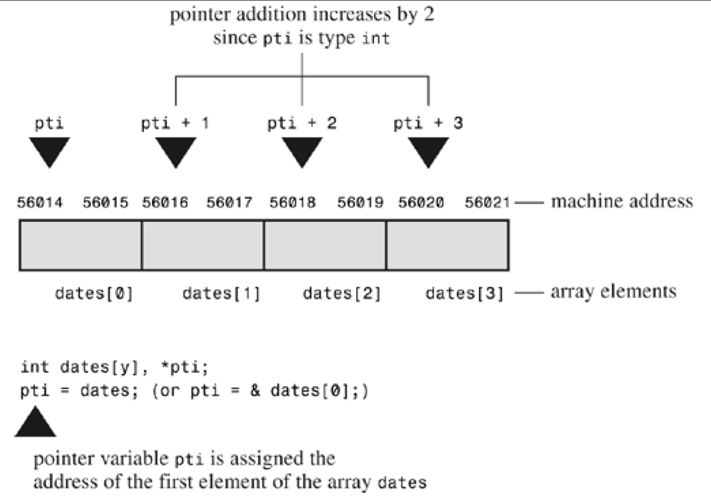

## Pointer

>Basically, a pointer is a **variable** (or, more generally, a data object) whose value is a **memory address**. Just as a char variable has a character as a value and an int variable has an integer as a value, <u>the pointer variable has an address as a value.</u>
-- <cite>C Primer Plus, Fifth Edition, By Stephen Prata</cite>

指针是一个**变量**，其值是另一个变量的内存地址


-- <cite>https://www.runoob.com/cprogramming/c-pointers.html</cite>

---

### 1. 指针的定义与基本操作

#### recap: `&`

使用**addressof operator**(取地址运算符) `&`，获取变量的内存地址：

```c
int a = 20;
printf("address of a: %p\n", &a);
```

output

```
address of a: 0x16bd11898
```

#### 1.1 定义指针变量

```c
datatype *ptr; // 数据类型 *指针变量名
```

Example:

```c
int a = 10;
int *p = &a; // 定义一个指针变量 p，并使其存储变量 a 的地址，即“让 p 指向 a”
```

`p` 与 `&a` 的区别：`p`是一个变量，`&a`是一个常量——`p`可以指向其他地址

```c
int b = 20;
p = &b;
```

#### 1.2 通过指针访问变量值

解引用运算符 `*`：

```c
printf("%d\n", *p); // 输出：20
```

#### 1.3 修改变量值

通过指针可以间接修改变量的值：

```c
*p = 30; // 修改 a 的值为 30
```

| 操作符       | 含义                  | 示例                   |
|-------------|--------------------------------|-------------|
| `&`         | addressof operator(取地址符)     | `&a` 获取变量 `a` 的储存地址 |
| `*`         | dereferencing operator(解引用符) | `*p` 获取指针 `p` 指向的变量的值 |

---

### 2. 常见的指针类型

#### 2.1 `NULL` (空指针)
- 空指针是一个不指向任何有效内存的指针
- 定义空指针：
  ```c
  int *p = NULL;
  ```
- 检查指针是否为空：
  ```c
  if (p == NULL) { //也可以简化为 if (!p)
      printf("empty pointer!\n");
  }
  ```

#### 2.2 `void *` (通用指针)

- 通用("generic")指针可以指向任意类型的数据
- 使用通用指针时需要强制类型转换：
  ```c
  void *ptr;
  int a = 10;
  ptr = &a; // void* 指向 int 类型的变量
  printf("通过通用指针访问值: %d\n", *(int *)ptr); // 强制类型转换：先转为 int*，再解引用
  ```

---

### 3. 指针与数组

> Because the hardware instructions of computing machines rely heavily on addresses, **pointers enable you to express yourself in a way that is close to how the machine expresses itself**. This correspondence makes programs with pointers efficient. In particular, pointers offer an efficient way to deal with arrays. Indeed, as you will see, <u>array notation is simply a disguised use of pointers</u>.
-- <cite>C Primer Plus, Fifth Edition, By Stephen Prata</cite>

> an array name is also the address of the first element of the array. That is, if flizny is an array, the following is true:
>```c
>flizny == &flizny[0]; // name of array is the address of the first >element
>```
>Both `flizny` and `&flizny[0]` represent the memory address of that first element. (Recall that & is the address operator.)
-- <cite>C Primer Plus, Fifth Edition, By Stephen Prata</cite>

<a name="array-pointer"></a>
数组名是指向第一个元素的指针


```c
int arr[5] = {1, 2, 3, 4, 5};
printf("%d\n", arr == &arr[0]); // output: 1
return 0;
```

| 表达式      | 含义                | 示例值   |
|-------------|---------------------|----------|
| `arr`       | 数组第一个元素的地址 | `&arr[0]` |
| `*arr`      | 数组第一个元素的值   | `1`      |
| `arr + i`   | 数组第 i 个元素的地址| `&arr[i]`|
| `*(arr + i)`| 数组第 i 个元素的值  | `arr[i]` |

**一点补充：**

> What is happening here is that when you say "add 1 to a pointer," **C adds one storage unit**. For arrays, that means the address is increased to the address of the next element, <u>not just the next byte</u>. *This is one reason why you have to declare the sort of object to which a pointer points*.
-- <cite>C Primer Plus, Fifth Edition, By Stephen Prata</cite>




>Now we can define more clearly what is meant by pointer-to-int, pointer-to-float, or pointer-to–any other data object:
>\- The value of a pointer is the address of the object to which it points. How the address is represented internally is hardware dependent. Many computers, including PCs and Macintoshes, are byte addressable, meaning that each byte in memory is numbered sequentially. Here, the address of a large object, such as type double variable, typically is <u>the address of the first byte of the object</u>.
>\- Applying the `*` operator to a pointer yields the value stored in the pointed-to object.
>\- **Adding 1 to the pointer increases its value by the size, in bytes, of the pointed-to type**.
-- <cite>C Primer Plus, Fifth Edition, By Stephen Prata</cite>

---

### 4. 指针与函数

#### 5.1 指针作为函数参数

通过指针传递参数可以实现函数对变量的修改。

```c
void change(int *p) {
    *p = 100;  // 修改 p 指向变量的值
}

int main() {
    int a = 10;
    change(&a);
    printf("a = %d\n", a);  // 输出: a = 100
    return 0;
}
```

#### 5.2 返回指针的函数

函数可以返回指针，但要保证返回的指针是有效的。

```c
int *getPointer() {
    static int a = 10; // 静态变量，作用域在函数内，但生命周期在整个程序运行期间
    return &a;
}
```

关于`static`关键字，可参考[这里](https://www.runoob.com/w3cnote/c-static-effect.html)

---

### 5. 动态内存分配

[这里](https://www.runoob.com/cprogramming/c-memory-management.html)的讲解很全面，这里只做简单介绍

#### 5.1 常用内存管理函数与运算符

- `malloc`：分配内存但不初始化
- `free`：释放动态分配的内存
- `calloc`：分配并初始化为 0
- `realloc`：重新调整内存大小
- `sizeof` 运算符：返回变量的大小

#### 5.3 `malloc` 与 `free`

`void free( void *ptr )`

- `malloc`：用于在堆区分配指定大小的内存，返回一个**指向分配内存的指针(pointer-to-void)**；如果分配失败，返回 `NULL`
  ```c
  void *malloc( size_t size ) // size_t 是无符号整数类型，表示大小（可以看作是 int），这里也可以用 int 型变量作为参数
  ```

- `free`：用于释放之前通过 `malloc` 分配的内存，释放后该内存可以被重新分配
  ```c
  void free( void *ptr );
  ```

示例：

```c
#include <stdio.h>
#include <stdlib.h>

int main() {
    int *p = (int *)malloc(5 * sizeof(int)); // 分配内存
             // 这里的 (int *) 是强制类型转换，将 pointer-to-void 转为 pointer-to-int
    
    if (p == NULL) {
        printf("内存分配失败！\n");
        return -1;
    }

    for (int i = 0; i < 5; i++)
        p[i] = i + 1; // 初始化

    // 操作，比如输出
    for (int i = 0; i < 5; i++)
        printf("%d ", p[i]);

    free(p); // 释放内存
    return 0;
}
```

---

### 6. 多级指针

多级指针指的是指向指针的指针，可以有多级嵌套（如二级指针、三级指针等），例如 `int **ptr1`，`int ***ptr`

#### 6.1 定义与使用

```c
int a = 10;      // 一个普通的整数
int *p = &a;     // 指针 p 指向 a
int **pp = &p;   // 指针 pp 指向指针 p
int ***ppp = &pp; // 指针 ppp 指向指针 pp

printf("a = %d\n", ***ppp); // 解引用3次，输出 a 的值
```

#### 6.2 多级指针与指针数组

指针数组是一个**数组**，数组中的每个元素是指针

```c
int a = 10, b = 20, c = 30;
int *arr[3] = {&a, &b, &c}; // 一个指针数组，每个元素存储一个指针
for (int i = 0; i < 3; i++) {
    printf("Value at arr[%d]: %d\n", i, *arr[i]);
}
```

示例：字符串指针数组

```c
const char *words[] = {"hello", "world", "C language"}; // 字符串指针数组
    for (int i = 0; i < 3; i++) {
        printf("%s\n", words[i]);
    }
```

###### 讨论：`arr` 与 `int **a` 的区别，其中 `arr` 为前面的指针数组

由之前对数组的讨论，数组名或数组的第一个元素的地址，是一个指针常量，因此，`arr` 与 `int **a` 的区别在于前者是一个指针常量，后者是一个指针变量

#### 6.3 多级指针与多维数组

关于[多级指针与多维数组](https://www.cnblogs.com/chenyangyao/p/5222696.html)

###### 动态分配二维数组

```c
int rows = 3, cols = 4;
int **array = (int **)malloc(rows * sizeof(int *));
// 二级指针，指向包含 rows 个一级指针的内存地址的首地址（指针数组的首位）
for (int i = 0; i < rows; i++) {
    array[i] = (int *)malloc(cols * sizeof(int));
}

// 初始化
for (int i = 0; i < rows; i++) {
    for (int j = 0; j < cols; j++) {
        array[i][j] = i * cols + j;
    }
}

// 操作（与二维数组无异）
for (int i = 0; i < rows; i++) {
    for (int j = 0; j < cols; j++) {
        printf("%d ", array[i][j]);
    }
    printf("\n");
}

// 释放内存
for (int i = 0; i < rows; i++) {
    free(array[i]);
}
free(array);
```

###### 讨论：二级指针动态分配二维数组 与 静态声明的二维数组

1. 相同：
   1. **访问方式一致**
      - 无论是动态分配还是静态声明，都可以通过 `arr[i][j]` 的方式访问元素。
      - 动态分配的二维数组模拟了静态二维数组的访问行为。

   2. **本质上都是二维结构**
      - 都能存储和操作二维数据，适用于类似的应用场景，例如矩阵运算或表格数据处理。

2. 区别：

    | **特性**                | **二级指针动态分配**                                   | **静态声明**                                 |
    |-----------------------|-----------------------------------------------------|--------------------------------------------|
    | **内存分配**           | 每一行独立分配内存，行与行之间地址不连续                       | 整个数组在内存中是一个连续块，每行地址固定偏移量            |
    | **内存访问效率**        | **行地址不连续**，可能导致缓存性能较差                         | **地址连续**，访问效率高                             |
    | **访问方式**           | 使用 `arr[i][j]`，**内部实际解引用两次指针**                 | 使用 `arr[i][j]`，**通过偏移量计算地址**                |
    | **指针行为**           | `arr` 是一个二级指针，可以动态分配和释放行内存              | `arr` 是一个固定的二维数组名，表示数组首地址             |
    | **灵活性**             | 可以动态改变行列大小，支持运行时分配                         | 数组大小在编译时确定，无法动态调整                  |
    | **内存释放**           | 需要逐行释放内存，然后释放指针数组本身                      | 自动管理，无需手动释放内存                          |

3. **内存布局**：

   1. **动态分配的二维数组**
        每一行内存单独分配，行与行之间地址可能不连续：
        ```
        arr --> [ 指向第1行的指针地址 ] --> 行1的内存
                [ 指向第2行的指针地址 ] --> 行2的内存
                [ 指向第3行的指针地址 ] --> 行3的内存
        ```

   2. **静态二维数组**
        内存是连续分配的，行与行之间的地址连续：
        ```
        arr --> 行1的内存 | 行2的内存 | 行3的内存
        ```

### a "quirk": int* a vs. int *a

summary of answers from [stackoverflow](https://stackoverflow.com/questions/3770187/difference-between-int-i-and-int-i)


在 C 语言中，`int* a` 和 `int *a` 本质上是一样的，它们都定义了一个**指向 `int` 类型的指针变量**，区别主要是编码风格和个人习惯：

1. **一点直观**
   - `int* a` 强调 `int*` 是一种类型，即 "指向 int 的指针"。
   - `int *a` 强调星号（`*`）是变量的一部分，即 "a 是一个指针"。

2. **多变量声明的区别**：
   - 无论使用哪种风格，以下声明：
     ```c
     int* i, j;
     int *i, j;
     ```
     都表示 `i` 是一个指针，而 `j` 是一个普通的整数。这是因为`*`运算符只作用于紧接它的变量。

   - 如果想声明两个指针，必须写成：
     ```c
     int *i, *j;
     ```

   - 更清晰的写法通常是：
     ```c
     int *i;
     int j;
     ```
3. `int *a`
   1. C 的声明是以表达式为中心的（expression-centric），而不是以对象为中心（object-centric）。
   2. 它更符合 C 的声明语法。例如，数组指针的声明：
      ```c
      int *a[N];
      ```
      与表达式 `*a[i]` 的使用方式一致。这体现了 C 的 "声明与使用相对应" 的原则。